# Student Management Dashboard - Architectural Diagrams

## 🏗️ System Architecture Overview

### 1. High-Level System Architecture

```mermaid
graph TB
    subgraph "Frontend Layer"
        A[App.tsx] --> B[Sidebar.tsx]
        A --> C[Dashboard.tsx]
        A --> D[StudentProfiles.tsx]
        A --> E[AttendanceTracker.tsx]
        A --> F[AssessmentScores.tsx]
        A --> G[ParticipationLogger.tsx]
        A --> H[BehavioralTracker.tsx]
    end
    
    subgraph "Data Layer"
        I[mockData.ts] --> J[mockStudents]
        I --> K[mockAttendance]
        I --> L[mockAssessments]
        I --> M[mockParticipation]
        I --> N[mockBehavioral]
    end
    
    subgraph "Type System"
        O[types/index.ts] --> P[Student Interface]
        O --> Q[AttendanceRecord Interface]
        O --> R[AssessmentScore Interface]
        O --> S[ParticipationLog Interface]
        O --> T[BehavioralRecord Interface]
        O --> U[DashboardStats Interface]
    end
    
    subgraph "UI Framework"
        V[React 18.3.1]
        W[TypeScript 5.5.3]
        X[Tailwind CSS 3.4.1]
        Y[Lucide React Icons]
        Z[Vite 5.4.2]
    end
    
    A --> I
    A --> O
    A --> V
    A --> W
    A --> X
    A --> Y
    A --> Z
```

## 📊 Component Architecture

### 2. Component Hierarchy & Data Flow

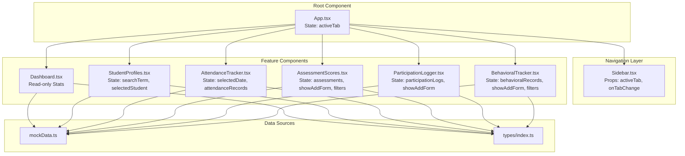

## 🔄 Data Flow Architecture

### 3. State Management & Data Flow

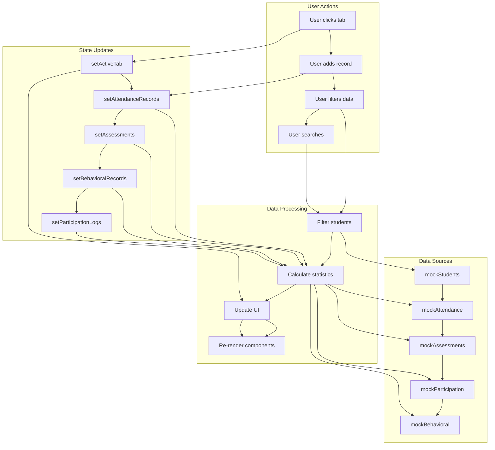

## 🗄️ Data Model Architecture

### 4. Entity Relationship Diagram

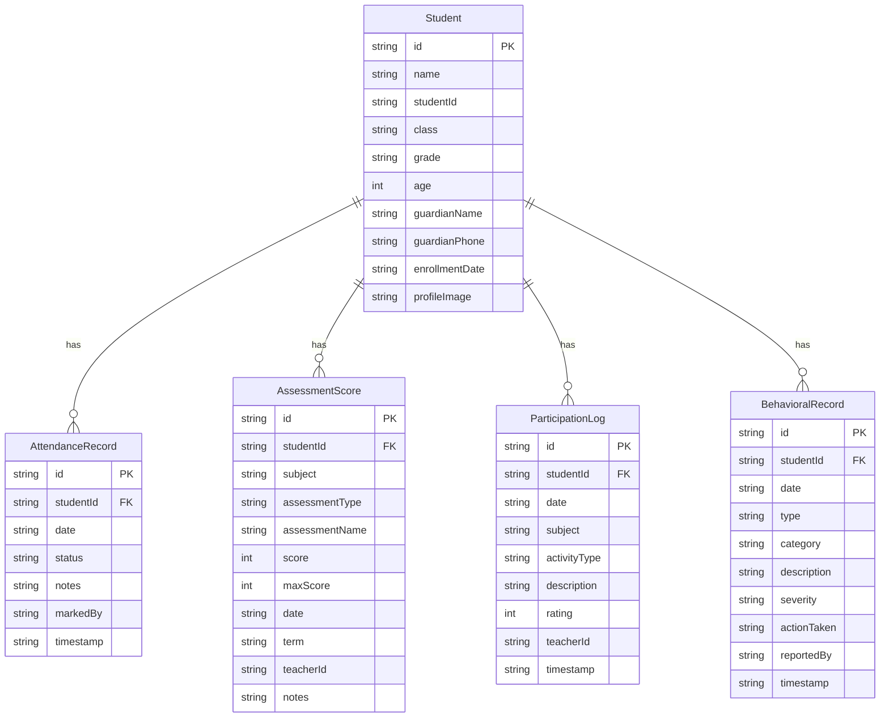

## 🔧 Component Interaction Architecture

### 5. Component Communication Flow

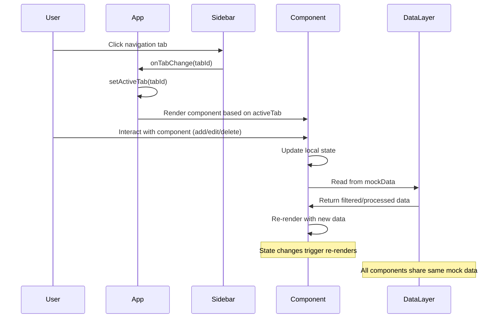

## 📱 UI Component Architecture

### 6. UI Component Structure

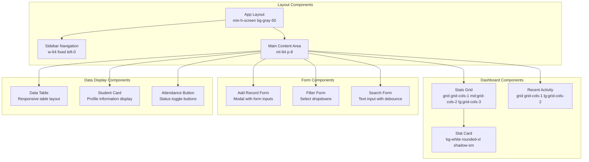

## 🚀 Performance Architecture

### 7. Rendering & Performance Flow

```mermaid
flowchart LR
    subgraph "Initial Load"
        IL1[Vite Dev Server] --> IL2[React App Mount]
        IL2 --> IL3[Component Tree Creation]
        IL3 --> IL4[Data Loading]
        IL4 --> IL5[Initial Render]
    end
    
    subgraph "User Interaction"
        UI1[User Action] --> UI2[State Update]
        UI2 --> UI3[Re-render Trigger]
        UI3 --> UI4[Component Update]
        UI4 --> UI5[DOM Update]
    end
    
    subgraph "Data Operations"
        DO1[Filter Operation] --> DO2[Sort Operation]
        DO2 --> DO3[Calculate Statistics]
        DO3 --> DO4[Update UI State]
    end
    
    IL5 --> UI1
    UI5 --> DO1
    DO4 --> UI3
```

## 🔒 Security & Validation Architecture

### 8. Data Validation Flow

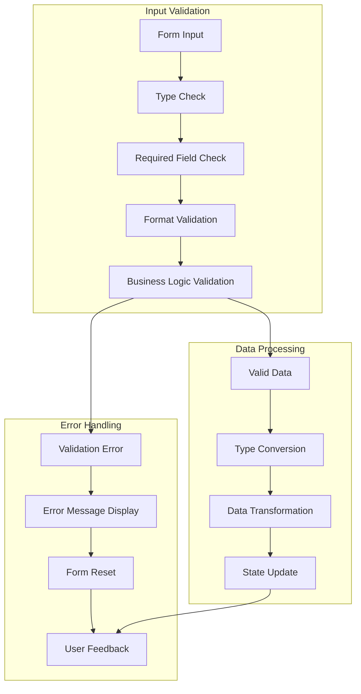

## 📊 State Management Architecture

### 9. State Distribution Across Components

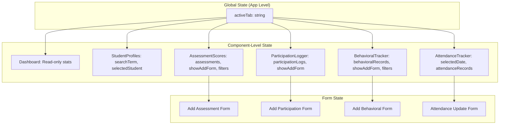

## 🎯 Key Architectural Patterns

### 10. Design Patterns Used

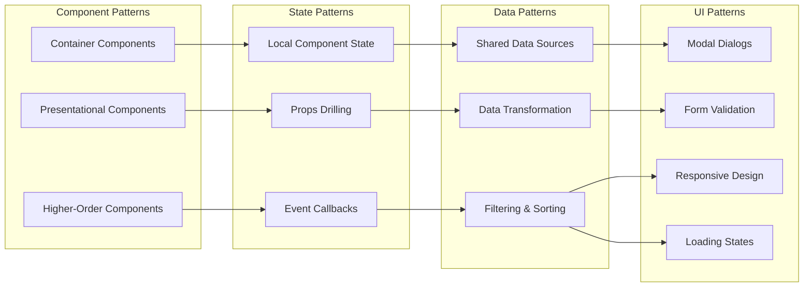

## 📈 Scalability Considerations

### 11. Architecture Scalability Matrix

| Component | Current State | Scalability Challenge | Proposed Solution |
|-----------|---------------|----------------------|-------------------|
| State Management | Local useState | Data synchronization | Context API / Redux |
| Data Persistence | Mock data only | No persistence | localStorage / Backend |
| Performance | Direct calculations | Large dataset handling | Memoization / Virtualization |
| Error Handling | Basic validation | Comprehensive error handling | Error boundaries |
| Testing | No tests | Quality assurance | Unit/Integration tests |
| Real-time Updates | Manual refresh | Live updates | WebSocket integration |

## 🔄 Data Flow Summary

### 12. Complete System Data Flow

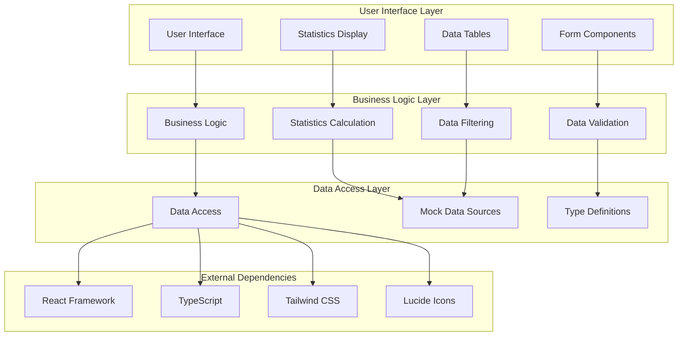

This comprehensive architectural documentation provides a complete view of the student management dashboard system's structure, data flow, and component interactions. The diagrams illustrate both the current implementation and areas for future enhancement. 